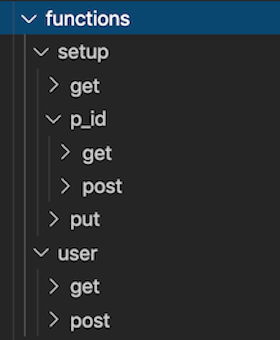
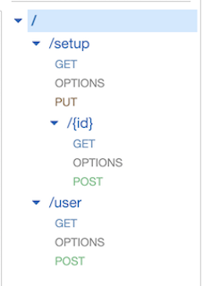

# SAM Template Generator

Generates a SAM Template for API Gateway and lambdas written in go.
Generates test and build script for each function.

Expects folder structure to match the desired API Gateway structure.

For example to create an API Gateway with a GET resource at path `/biscuits`, add the handler to the function at `biscuits/get`. A PUT would then go at `biscuits/put`.

Example folder structure and API Gateway result:




## Outputs

govet_gotest.sh
Script to test all functions

gobuild.sh
Script to build all functions, outputs a mirrored directory structure with built binaries

template.yml
SAM template to create API Gateway and Lambda functions 

## Usage

Install the npm package
`npm install samtemplategenerator --save`

```
const generate = require('samtemplategenerator');
generate(templatePath, pathToFunctions, outputDirectory);
```

### Input parameters

#### Template Path

Path to templates

SamTemplateGenerator expects 2 templates in the directory `base.yml` and `function.yml`

## Templates

- `base.yml` will appear once at the top of the file
- For each function, `function.yml` will be parsed and the tokens replaced for that function

Tokens

For a function at /biscuits/get

| Token name | Description | Example |
|---|---|---|
| Name | The name of the resource in the SAM template | biscuitsget |
| CodeUri | Location of code binary after build | bin/biscuits/ |
| Handler | Which binary to use in folder | /get |
| Path | Location of resource | /biscuits |
| Method | Http Method | get |

### Examples

#### base.yml

```
AWSTemplateFormatVersion: 2010-09-09
Transform: AWS::Serverless-2016-10-31
Parameters:
  SecurityGroupIds: 
    Type: List<AWS::EC2::SecurityGroup::Id>
    Description: Security Group IDs that Lambda will use
  VpcSubnetIds: 
    Type: List<AWS::EC2::Subnet::Id>
    Description: VPC Subnet IDs that Lambda will use (min 2 for HA)

Resources:
  DfdApi:
    Type: AWS::Serverless::Api
    Properties:
      StageName: Prod
      Cors:
        AllowHeaders: "'Content-Type,Authorization'"
        AllowMethods: "'OPTIONS,POST,GET,PUT,DELETE'"
        AllowOrigin: "'*'"
      Auth:
        Authorizers:
          CognitoAuthorizer:
            UserPoolArn: arn:aws:cognito-idp:eu-west-2:<account-id>:userpool/eu-west-2_1234abcd
```

#### function.yml

```
  {{Name}}:
    Type: AWS::Serverless::Function
    Properties:
      CodeUri: bin{{CodeUri}}/
      Handler: {{Handler}}
      Runtime: go1.x
      Tracing: Active
      Role: arn:aws:iam::<account-id>:role/api-lambda-role
      Events:
        GetEvent:
          Type: Api
          Properties:
            RestApiId: !Ref DfdApi
            Path: {{Path}}
            Method: {{Method}}
            Auth:
              Authorizer: CognitoAuthorizer
      Policies:
        - VPCAccessPolicy: {}
        # This policy gives permission for Lambdas to create/manage ENIs
        # SAM Policy templates you can use: https://github.com/awslabs/serverless-application-model/blob/develop/examples/2016-10-31/policy_templates/all_policy_templates.yaml
      VpcConfig:
        SecurityGroupIds: !Ref SecurityGroupIds
        SubnetIds: !Ref VpcSubnetIds
```
